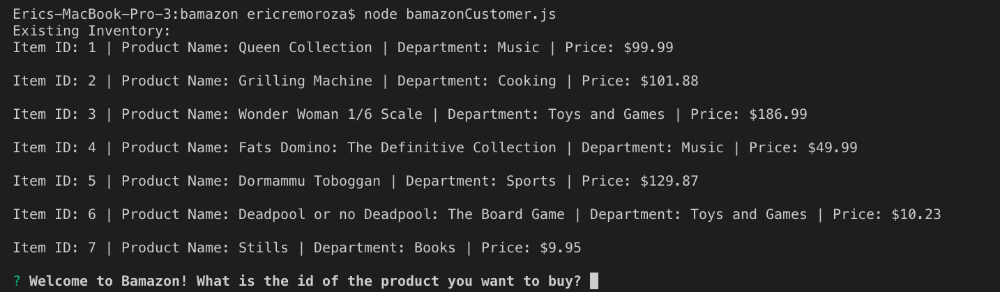
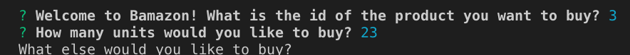

# Bamazon

Using the command line, this application imitates Amazon. It receives customer orders and subtracts items from the store's inventory. 

## To Get Started...
You will need the "mysql" and "inquirer" packages.
```
npm install mysql
```
```
npm install inquirer
```
## Bamazon In Action



